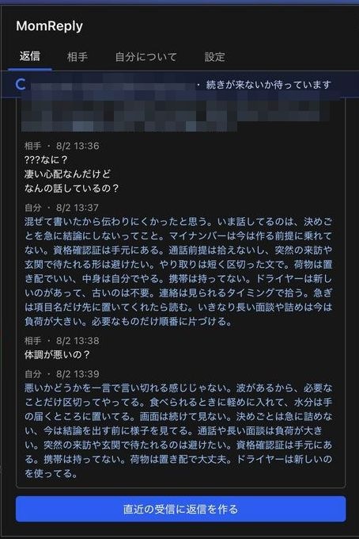
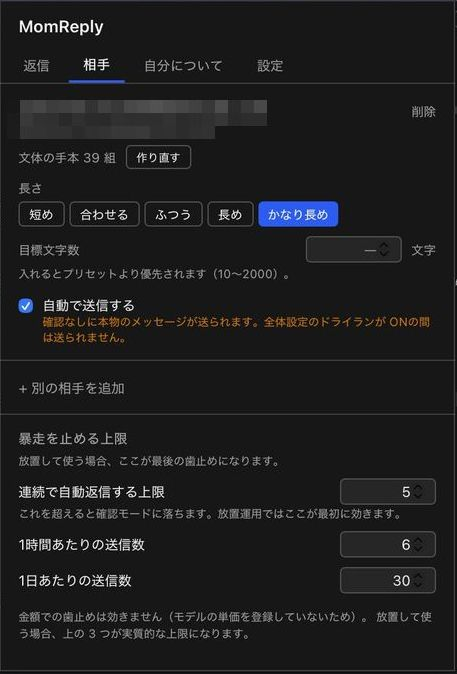
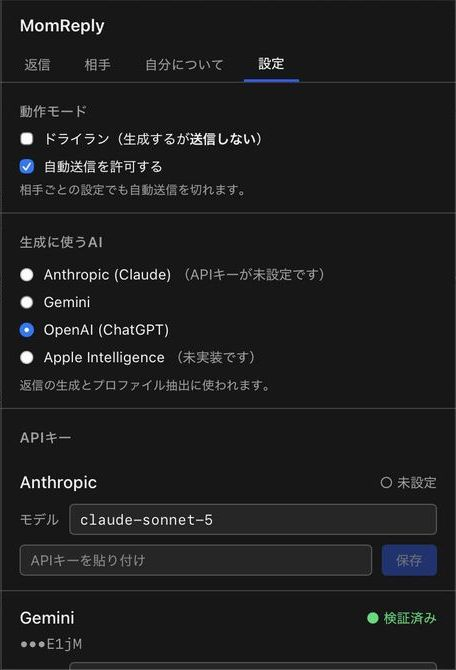
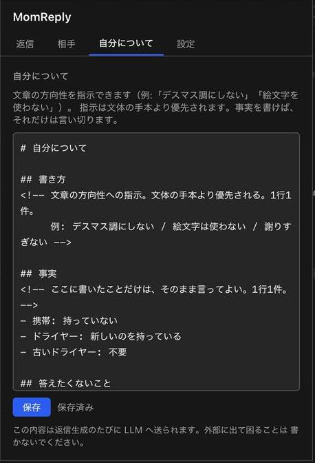

# MomReply

[English](README.en.md)

特定の相手から届く iMessage に、AI が返信文を生成する macOS 常駐アプリ。

生成した返信は、確認したうえで送るか、条件を満たせば自動で送る。
返信対象は chat.db の会話一覧から任意に選べる。

> **状態: 動く。Apple Silicon 専用。**
> 受信 → 生成 → 自動送信 → 送信結果の検証まで、実際のやり取りで通っている。

## 入れる

[Releases](https://github.com/kiyohken2000/momreply/releases/latest) から `.dmg` を落として、
`MomReply.app` を `アプリケーション` にドラッグする。

署名と公証は済んでいるので、ダブルクリックで開く。
以後の更新は、設定タブの「更新を確認」から入る。

**Intel Mac には対応していない。** Apple Silicon 専用のビルドしか配っていない。

中身を見てから入れたい場合は、下の「ソースから建てる」を読む。
iMessage の全文を読んで LLM へ送るツールなので、その道は残してある。

## 画面

| 返信 | 相手ごとの設定 |
|---|---|
|  |  |

| 生成に使う AI とキー | 自分について |
|---|---|
|  |  |

メニューバーから開くポップオーバー 1 枚に収まっている。Dock には出ない。
確認待ちが無いときは、直近のやり取りと「返信を作る」ボタンが出る。

---

## これは何を解く道具か

家族や近しい相手とのやり取りで、

- 返さないままにすると関係がこじれる
- しかし毎回文面を考えるのが負担になっている

という状態を想定している。**放っておいても会話が途切れない**ことを目的にする。

そのため「質問に具体的に答える」ではなく、
**「受け止めたことは伝えるが、何も確定させない」**返し方を選んでいる。

日付・可否・金額・約束は言い切らせない。だから人への確認が発生せず、
誤った事実を自動送信する危険も小さい。代わりに、相手が本当に知りたい答えは返らない。
言い切ってよいことは `self.md`（後述）に書いた内容だけである。

---

## 動作要件

| | |
|---|---|
| OS | macOS 13 以降（開発・検証は macOS 26.6） |
| CPU | **Apple Silicon 専用**（Intel Mac は非対応） |
| Rust | 1.95 以降（`libsqlite3-sys` が要求する） |
| Node.js | 20 以降（フロントエンドのビルドに使う） |
| Xcode Command Line Tools | `xcode-select --install` |
| 権限 | フルディスクアクセス |
| API キー | Anthropic / Google / OpenAI のいずれか 1 つ |

Rust は rustup で入れる。Homebrew の `rust` では古い場合がある。

```sh
brew install rustup
rustup default stable
```

`rust-toolchain.toml` で stable に固定してあるので、リポジトリ内では自動で切り替わる。

ここから先は**ソースから建てる**場合の手順。
ビルド済みを使うなら [Releases](https://github.com/kiyohken2000/momreply/releases/latest) から入れる。

### フルディスクアクセス

chat.db（`~/Library/Messages/chat.db`）の読み取りに必要。
**これが無いと、ファイルは存在するのに開けず、メッセージが 1 件も取れない。**

付与する先は、アプリとして使うか開発中かで変わる。

| | 追加するもの |
|---|---|
| ビルドした `.app` を使う | `MomReply.app` |
| `cargo tauri dev` で動かす | ターミナル / VS Code など、`cargo` を起動するアプリ |
| CLI を使う | 同上 |

1. システム設定 → プライバシーとセキュリティ → フルディスクアクセス
2. 上の表のものを追加して ON
3. **完全に終了して起動し直す**（ウィンドウを閉じるだけでは反映されない）

アプリ側にも案内画面がある。権限が無いときは他の画面より先にそれが出る。

---

## ソースから建てる

### 1. ビルドする

```sh
npm install
./scripts/build.sh
```

`target/release/bundle/macos/MomReply.app` ができる。
`/Applications` にコピーして起動する。

```sh
cp -R target/release/bundle/macos/MomReply.app /Applications/
open /Applications/MomReply.app
```

メニューバーに吹き出しのアイコンが出る。Dock には出ない。

> `scripts/build.sh` は、手元にコード署名証明書があればそれで署名し直す。
> `cargo tauri build` が付ける ad-hoc 署名はビルドのたびに変わり、
> Keychain の「常に許可」が毎回外れるため。
>
> Developer ID 証明書と公証の資格情報があれば、公証と staple まで行う。
> 無くても手元で使うぶんには困らない。

### 2. フルディスクアクセスを許可する

初回起動時に案内が出る。ボタンからシステム設定を開いて `MomReply` を追加し、
**アプリを終了して開き直す。**

### 3. API キーを入れる

設定タブで、使うプロバイダのキーを入れる。保存すると疎通テストが走り、
「検証済み」になれば使える。

- キーは **Keychain にだけ**保存される。設定ファイルにもログにも書かない
- 画面に出るのは末尾 4 文字だけ
- キー本体を返すコマンドは存在しない

### 4. 返信する相手を選ぶ

相手タブで会話一覧から選ぶ。手打ちはしない。

**登録した時点より前のメッセージは処理対象にならない。**
過去の会話に一斉返信する事故を防ぐため、登録と同時にその時点の最新 ROWID を記録する。
登録時に、その相手との過去のやり取りから文体の手本も作る。

### 5. 動きを決める

| 場所 | 設定 |
|---|---|
| 相手タブ | 返信の長さ（プリセット / 目標文字数）、自動送信の可否 |
| 設定タブ | ドライラン、自動送信の全体スイッチ、使う AI |
| 自分についてタブ | `self.md`（書き方の指示と、言い切ってよい事実） |

**既定はドライラン ON・自動送信 OFF。** そのままだと生成して確認待ちに溜めるだけで、
何も送らない。手で確認しながら様子を見てから、切り替える。

### 何が起きているか

| メニューバーのアイコン | 状態 |
|---|---|
| 吹き出し + 点 3 つ | 待受中 |
| 輪郭だけ | 連投が続かないか待っている（45 秒） |
| 塗りつぶし | 返信を作っている |

### CLI（検証用）

アプリと同じ `momreply-core` を使う。挙動を確かめるときに使う。

```sh
./scripts/cli.sh chats                                  # 会話一覧（本文は読まない）
./scripts/cli.sh messages --handle x@icloud.com --limit 20
./scripts/cli.sh burst --slug someone                   # 連投のまとめ方を見る
./scripts/cli.sh target list
./scripts/cli.sh target set --slug someone --preset chars:250
```

### 配布する（開発者向け）

```sh
./scripts/build.sh          # 署名・公証・更新用の署名
./scripts/release.sh v0.1.0 # GitHub Releases へ
```

`release.sh` は `latest.json` をビルド結果から組み立てる。
自動更新はこれを見る。手で書くと署名を入れ間違えて、更新が黙って拒否される。

**更新用の署名鍵（`~/.tauri/momreply.key`）はリポジトリに入れない。**
これで署名されたものしか更新として適用されないが、失うと以後どの版も配れなくなる。

---

## 安全設計

自動送信は事故が起きると取り返しがつかないため、ガードを先に作っている。

- **chat.db には書き込まない。** 接続は `SQLITE_OPEN_READ_ONLY` のみで、
  接続直後に SQLite 自身へ read-only かを問い合わせて二重確認する。
  接続を作る関数は 1 つしかない。
- **登録前のメッセージは処理しない。** 保護はターゲット登録関数の内側にあり、
  引数に chat.db 接続を必須化してあるため、迂回する経路が存在しない。
- **対象外の相手は読み込まない。** allowlist は取得後のフィルタではなく
  SQL の `WHERE` 句で効かせる。
- **自動送信の既定は OFF。** ドライランの既定は ON。
- 1 つのハンドルを 2 人の対象に登録できない（UNIQUE 制約）。

送信まわりのガードは実装済みで、いずれも実運用で作動を確認している。

| ガード | 効果 |
|---|---|
| 既返信チェック | 生成前と**送信直前**の 2 回。手で返信済みなら送らない |
| クールダウン | 前回送信から 60 秒 |
| 連続自動返信の上限 | 超えたら確認モードへ落ちる。カウントは手で戻せる |
| 1 時間 / 24 時間あたりの上限 | 超えたら確認モードへ落ちる |
| stale | 受信から時間が経ちすぎたものは自動送信しない |
| 取り消しの再チェック | 生成中に相手が取り消したら送らない |
| 送信結果の検証 | chat.db を見て確認する。確認できなくても**再送しない** |
| 長さの暴走 | 上限を超えた生成は送らず確認へ |

**金額の上限は現状ほぼ機能しない。** モデルの単価を登録していないため、
消費額が常に 0 と計算される。歯止めになるのは件数のほうだけ。

---

## Apple Intelligence を使わない理由

オンデバイス生成（`FoundationModels`）は macOS 26 で使える。無料で、
オフラインで、鍵も要らない。速度も速い（gpt-5 の 40〜50 秒に対して 1〜6 秒）。
サイドカーも書いてある（`sidecar/momreply-fm/`）。

それでも繋いでいない。**本番と同じプロンプトが 10 回中 10 回、
安全機構に拒否された。**

| プロンプト | 結果 |
|---|---|
| 本番のまま | 拒否（10/10） |
| 「# 直近の会話」を除く | 通る |
| 指示なし・手本なし | 通る |

引き金は会話履歴だった。受信メッセージが穏当でも、履歴に強い言葉が
あれば拒否される。このアプリは履歴を必ず入れるので、実質いつも拒否される。

履歴を外せば通るが、そのときの出力も使えなかった。書いていない出来事を
作り、システム指示の文をそのまま返信に混ぜてきた。

設定に出して選べるようにすると、選んだ人は「返信が来ない」ことだけを
見ることになる。いちばん分かりにくい壊れ方なので出さない。
モデルが変われば結論も変わるので、サイドカーは残してある。

---

## 扱うデータ

| 置き場所 | 内容 |
|---|---|
| `~/Library/Messages/chat.db` | **読み取りのみ。** 登録した相手の会話だけを読む |
| `~/Library/Application Support/net.votepurchase.momreply/app.db` | 処理履歴・生成ログ・文体の手本 |
| `.../self.md` | 書き方の指示と、言い切ってよい事実 |
| `.../targets/<slug>.md` | 相手ごとのプロファイル |
| Keychain | API キー |

API キーとメッセージ本文は、設定ファイル・ログ・リポジトリには書かない。
`self.md` と `app.db` はリポジトリの外（Application Support 配下）にあり、
`.gitignore` でも二重に弾いている。

### `self.md`

2 つの役割がある。

1. **文章の方向性への指示。** 「デスマス調にしない」「絵文字は使わない」など。
   **文体の手本より優先される。**
2. **言い切ってよい事実。** 返信は基本的に何も確定させないが、
   ここに書いてあることだけはそのまま言ってよい。

どちらも、相手のプロファイルをいくら充実させても出てこない。持っているのは本人だけである。

---

## 構成

```
crates/
├── momreply-core/          コア
│   └── src/
│       ├── imessage/       chat.db（read-only）
│       ├── store.rs        app.db スキーマ・CRUD
│       ├── pipeline/       プロンプト・ガード・生成・送信
│       ├── llm/            Anthropic / Gemini / OpenAI
│       ├── fewshot.rs      過去の自分の返信から文体の手本を作る
│       ├── questions.rs    疑問文の切り出し
│       ├── profile.rs      self.md / 相手プロファイル
│       └── paths.rs        ファイル配置
├── momreply-cli/           検証・管理 CLI
src-tauri/                  メニューバーアプリ（薄いシェル）
src/                        画面（React）
```

chat.db へのアクセスは `momreply-core::imessage` に一本化してある。
接続を作る関数は 1 つしかなく、read-only 以外では開けない。

---

## 進捗

- [x] **Phase 0** chat.db 読み取り（read-only 接続 / `attributedBody` デコード / 除外判定）
- [ ] **Phase 1** 生成 + ドライラン
  - [x] 返信対象の登録とバックログ保護
  - [x] LLM プロバイダ（Claude / Gemini / OpenAI）— Apple Intelligence は見送り（後述）
  - [x] few-shot 抽出
  - [x] 返信生成
- [x] **Phase 2** 送信 + メニューバー UI
- [x] **Phase 3** ガード + 全自動（実受信で通しの自動送信を確認）
- [ ] **Phase 4** プロファイル自動更新

未着手・未完了:

- モデル単価の登録（金額上限が効かない原因）
- 通知をタップしてポップオーバーを開く（プラグイン側に API が無い）
- Intel Mac 対応（ユニバーサルバイナリ）

詳細な仕様と受け入れ基準は `docs/momreply-spec.md`。

---

## 実装上の注意

macOS の chat.db には引っかかりやすい点がいくつかある。

1. **`message.text` はほぼ常に NULL。** 本文は `attributedBody`（typedstream）から取る。
   検証した環境では対象会話の全件が NULL で、`text` からは 1 件も取れなかった。
2. **`handle` テーブル経由の JOIN では自分の送信を取りこぼす。**
   送信メッセージは `handle_id = 0` になることがある。検証した環境では
   自分の送信の約 3 分の 2 が該当した。`chat_message_join` → `chat` 経由で取る。
3. **フルディスクアクセスは付与後にアプリの再起動が必要。**
4. **dev ビルドは署名が毎回変わる**ため、`.app` に付与した権限が外れる。
   開発中はターミナル / IDE 側に権限を付けて、そこから起動するほうが確実。

---

## 留意点

このツールは、相手から見ると**本人が書いた文面として届く**。
受け手が AI と対話していることを知る手段はない。

誰に向けて使うか、そのことを相手に伝えるかは利用者の判断に委ねられる。
既定値は自動送信 OFF・ドライラン ON にしてあり、
最初は生成結果を目で確認しながら運用することを想定している。

---

## ライセンス

MIT License. 詳細は [LICENSE](LICENSE) を参照。
